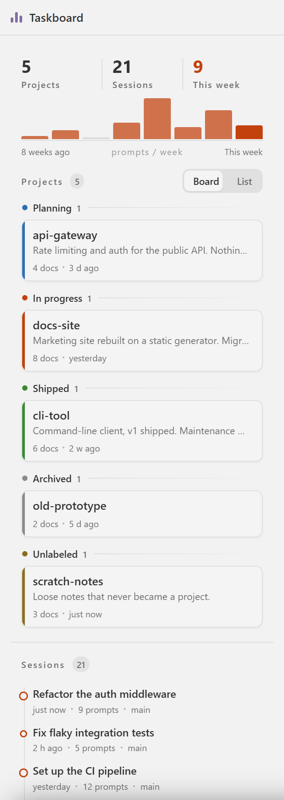

# 任务面板 · Claude Taskboard

VS Code 侧边栏面板，把 **Claude Code 会话**和**项目文件夹**集中到一处。

它回答两个用得越久越难回答的问题：

- **上次聊到哪了？** 攒了 40 个会话，当初那个答案在哪个里面？
- **什么还活着？** 项目散在好几个目录，有的在做，有的早就停了。

全部本地运行。没有账号、不联网、不收集任何数据。



---

## 功能

### 会话时间线

工作区里的每一次 Claude Code 对话，最新的在最上面。**节点大小 = 该会话的提问数**，
话多的那些一眼就能看出来。

- **点会话条目** → 弹出预览：首条提问 + 最后三条回复
- **点气泡按钮** → 在 Claude Code 扩展里重新打开那次对话。不用终端，不用复制会话 ID

### 工作脉搏

顶部一条 8 周条带，每根 = 一周的提问数。

**什么都没干的周不会消失**，会留一根极淡的基线。如果你每周只有几个小时，
这个节奏是面板上最有用的信息——而且别处看不到。

### 项目区：看板 / 列表

读一个装着项目文件夹的目录。状态编码在**目录名后缀**里：

```
my-app-active        → 开发中   （橙色脊）
my-app-planning      → 规划中   （蓝色脊）
my-app-done          → 已完成   （绿色脊）
my-app-archived      → 已归档   （灰色脊）
some-folder          → 未标注   （黄色脊）
```

中文状态词当然也认，见下方[项目文件夹](#项目文件夹)。

### 深色主题下的玻璃质感

深色主题下面板用半透明的「液态玻璃」处理；浅色主题保持扁平清晰——
玻璃浮在一整片浅色底上只会显脏。不同意的话用 `taskboard.glassEffect` 覆盖。

---

## 安装

**从市场装**：在扩展视图里搜 **Claude Taskboard**。

**从 VSIX 装**：

```bash
code --install-extension claude-taskboard-0.1.0.vsix
```

**从源码装**：

```bash
git clone https://github.com/dongbeixiaohan777/claude-taskboard.git
cd claude-taskboard
npx @vscode/vsce package --allow-missing-repository
code --install-extension claude-taskboard-0.1.0.vsix
```

重启 VS Code。图标出现在活动栏**最下方**。

> **关于图标位置**：VS Code 没有提供「把扩展图标钉到活动栏底部」的 API。
> 新装的扩展排在最后，也就是账户和设置按钮正上方——这是能达到的最靠下的位置。
> 之后如果再装别的带活动栏图标的扩展，它会排到你下面。**按住图标拖动可以调整顺序**，
> VS Code 会记住。

---

## 设置

| 设置项 | 默认 | 说明 |
|---|---|---|
| `taskboard.projectsDir` | 空 | 装项目文件夹的目录。留空则自动探测 |
| `taskboard.glassEffect` | `auto` | `auto`（仅深色主题开玻璃）· `on` · `off` |

### `taskboard.projectsDir` 的自动探测

设置留空时，面板按顺序找下面这些（相对工作区根目录），**用第一个存在的**：

```
KB/02-项目          projects/          docs/projects/          taskboard/
```

都没找到？项目区显示空状态而已，会话区照常工作。也可以直接把设置项指到任何地方。

---

## 数据从哪来

**会话**读自 `~/.claude/projects/<工作区编码名>/`。面板**不猜编码规则**——
它遍历那个目录，用每个 `.jsonl` 里记录的 `cwd` 字段反查匹配。
这样即使 Claude Code 改了目录命名方式，也依然能找到。

**提问计数**排除系统生成的噪音：

| 记录形态 | 算不算 |
|---|---|
| 正常打字的消息 | 算 |
| `<task-notification>`（后台任务通知） | 不算 |
| `<command-name>` 等（斜杠命令调用） | 不算 |
| `<ide_opened_file>…</ide_opened_file>改一下这个 bug` | **算** —— 剥掉标签，`改一下这个 bug` 计入 |
| 工具返回值、`isMeta` 记录 | 不算 |

解析是流式的，几十 MB 的会话文件不会爆内存。

**时间戳**取所有带时间戳记录的最小/最大值，而不是首行末行——
有些文件因为 resume 和队列消息存在乱序条目。

---

## 项目文件夹

把 `taskboard.projectsDir` 指到一个「每个子目录是一个项目」的文件夹。
面板会读每个项目的 `README.md`（第一个非标题行作为卡片摘要），并统计文档数。

状态来自目录名后缀。下面这些词都认，**大小写不敏感**：

| 状态 | 可用的后缀 |
|---|---|
| 规划中 | `planning`、`plan`、`规划中` |
| 开发中 | `active`、`in-progress`、`wip`、`开发中` |
| 已完成 | `done`、`shipped`、`complete`、`completed`、`已上线`、`已完成` |
| 已归档 | `archived`、`archive`、`已归档` |

没有可识别的后缀 → **未标注**。目录照样显示，**不会丢**。

---

## 环境要求

- VS Code **1.85** 或更新
- **重新打开会话**需要 [Claude Code](https://marketplace.visualstudio.com/items?itemName=anthropic.claude-code)
  扩展。没装的话预览照常可用，只是隐藏重新打开按钮

---

## 隐私

扩展只读本地文件并渲染。**不发任何网络请求、不收集遥测、不写入你的会话或项目文件。**
唯一写入的是 VS Code 自己扩展存储目录里的一个扫描缓存。

---

## 已知限制

- **重新打开会话**用的是 Claude Code 扩展的内部命令
  （`claude-vscode.editor.open`）加一条公开深链
  （`vscode://anthropic.claude-code/open?session=…`）。深链是命令失效时的兜底。
  两者都失效时，预览仍然可用。
- **斜杠命令不算提问**。如果你跑了 `/my-command` 然后又说了一遍真实需求，
  都算进去会把同一个意图重复计数。
- **面板是只读的**。不支持在里面新建、编辑、拖动排序。

---

## 开发

```bash
node --test test/*.test.js    # 单元测试，零依赖，用 Node 内置测试框架
node test/smoke.mjs           # 扫你真实的 ~/.claude/projects 并打印表格
node dev/render-all.mjs       # 重新生成截图（无头 Chrome，不装任何 npm 包）
```

### 重新生成截图

`dev/render-all.mjs` 用一个进程渲染全部面板变体，调用你系统装的 Chrome 或 Edge 无头模式 ——
**不需要 playwright、不需要 puppeteer、不需要 npm install**。

```bash
node dev/render-all.mjs                # 本 README 用的那三张
node dev/render-all.mjs --set all      # 所有主题 × 视图 × 语言组合
node dev/render-all.mjs --out /tmp/x   # 换输出目录
```

它用 **`dev/demo-data.js`** 的虚构数据渲染（`docs-site`、`api-gateway`、`cli-tool`），
而不是任何人的真实工作区。**面板截图是烤进像素的文字，grep 检查不出泄露** ——
把演示数据和真实数据彻底分开，是唯一可靠的防线。

改完代码后：命令面板 → `Reload Window`。

### 目录结构

```
src/extension.js       激活入口，纯装配
src/store.js           唯一数据源：扫描 + 缓存 + 事件
src/panel.js           webview 宿主（CSP / nonce / 消息协议）
src/claude.js          Claude Code 集成 —— 唯一依赖别的扩展的一处
src/watcher.js         文件监听 + 去抖 + 兜底轮询
src/cache.js           扫描结果落盘缓存（原子写）
src/i18n.js            字符串表（扩展侧）
src/lib/               纯 Node，不 import vscode，可直接单测
media/                 webview：style.css / glass.css / i18n.js / views.js / main.js
dev/preview.html       设计沙盘 —— 浏览器打开就能迭代视觉
dev/shot.html          同上，但专供截图：中性演示数据、无沙盘工具栏
dev/render-all.mjs     批量截图器（无头 Chrome，零依赖）
docs/                  交给编码 agent 的任务书（大部分代码是它写的）
```

### 两处刻意的偏离

1. **用 CommonJS，不用 ESM。** 扩展宿主里 ESM 会让 `require('vscode')` 报
   `require is not defined`
2. **零构建步骤。** 没有 TypeScript、没有打包器。代价是没有类型检查，
   缓解手段是 `src/lib/` 从不 import `vscode`，可以直接单测

### 主题令牌必须挂 `body`，不能挂 `:root`

VS Code 在运行时把 `--vscode-*` 变量注入到 `body` 上。若把
`--c-bg: var(--vscode-sideBar-background)` 这类派生令牌定义在 `:root`，
解析时取不到 `body` 上的值，会**静默回落到硬编码兜底** ——
表现为「切主题完全没反应」，不管你选哪个主题都是同一套颜色。**我为此搭进去一下午。**

---

## 许可

MIT —— 见 [LICENSE](LICENSE)。

[English](README.md)
